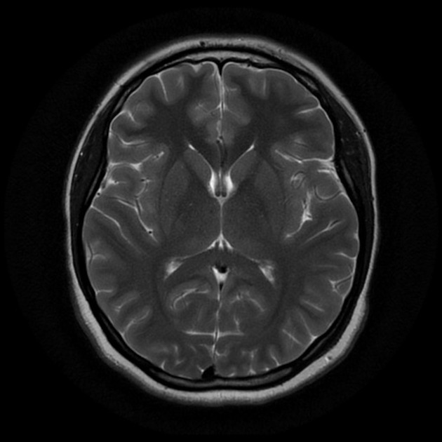
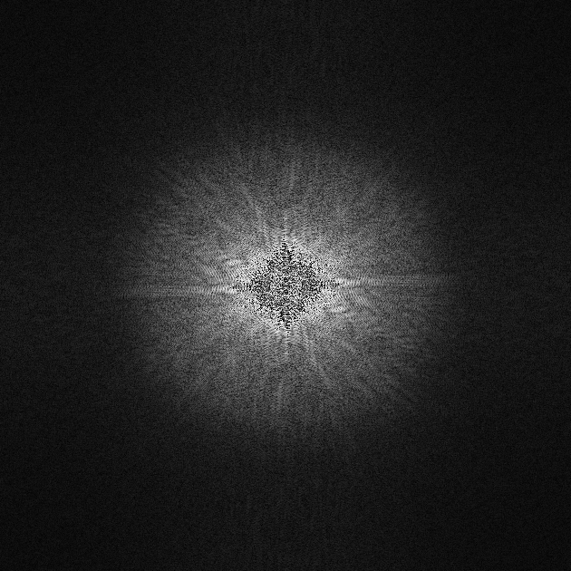

| Programming task |                             #2                             |
| :--------------: | :----------------------------------------------------------: |
|      **By**      | **-Adel Moustafa**  **-Mahmoud Abdelrhman**  **-Mohamed Kamal**  **-Mohamed Yasser** |
|      **To**      |                  **Prof/ Inas A. Yassine**                   |

# Bulk magnetization vector
 ​There are three functions used to rotate the bulk magnetization vector and plot its trajectory:

**1.Excitation:** It's used to rotate the bulk magnetization and it's trajectory during excitation process

**2.Relaxation:** It's used to rotate the bulk magnetization and it's trajectory during relaxation process.

**3.Update_line:** It's used to update the plotted data.

In addition to **get_parametesrs()** used to get parameters by console.

**because of nonuniformity effect spins in same box wil have different Larmor freq ,so the spins will have different trajectory**
   
This GIFs is to simulate Bulk magnetization vector rotation.

**Exitation GIF**

**Relaxition GIF**

# K-space

The K-space of this Image is calculated using the function **image_to_kspace()**,first we shift the image  by N/2 . This is simply done by the function, **np.fft.ifftshift()**.
, then we get fourier for the result by **np.fft.fftn()**.the we aplly shift on fourrier  by N/2 using **np.fft.ifftshift()**.the result is k-space

image we will get it in k-space

and this is k-space  Image. 

